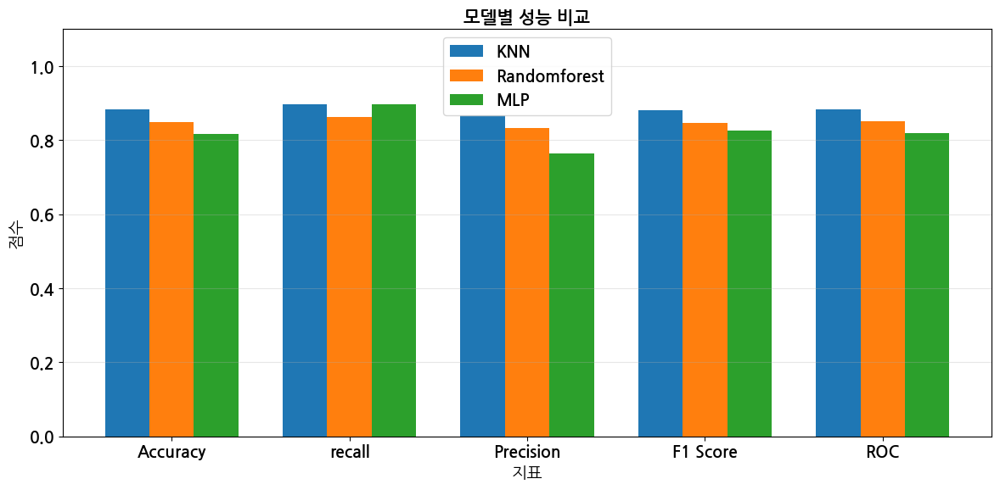
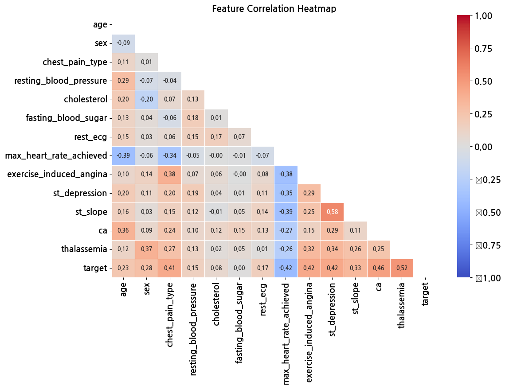
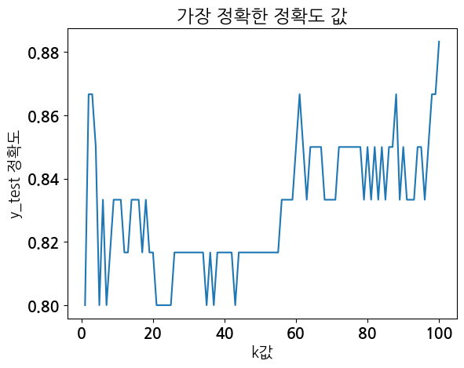
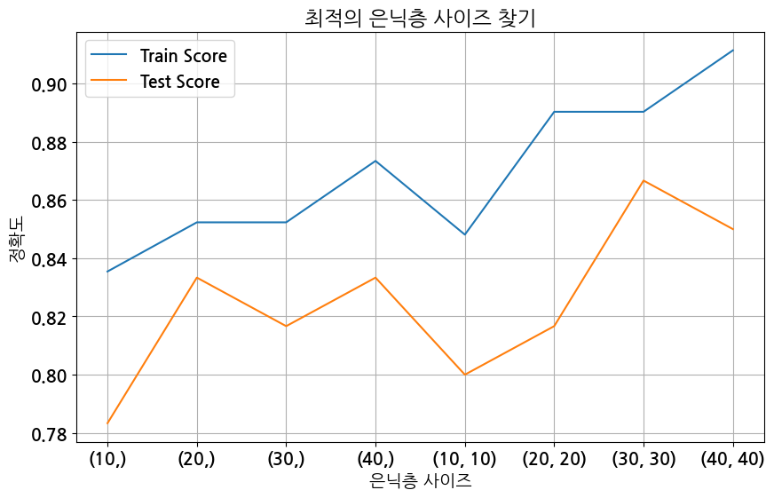
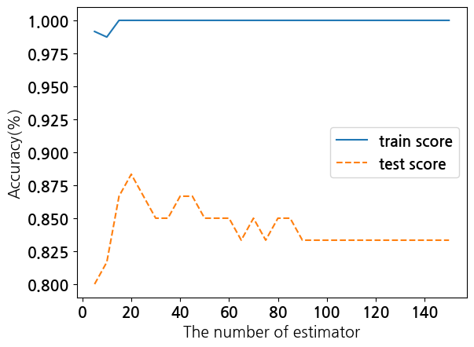
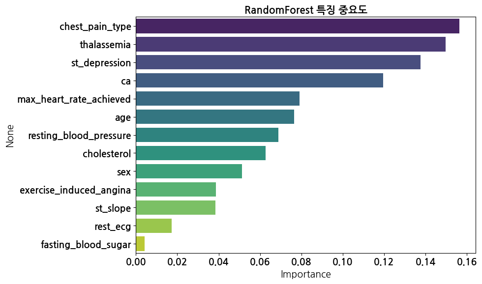
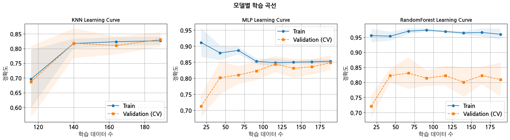
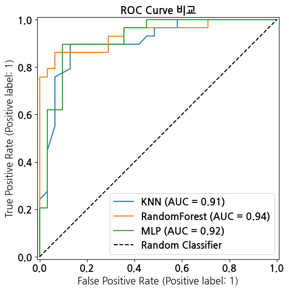

# 심장병 예측 모델 (Heart Disease Prediction)

> Heart Disease Prediction using KNN · MLP · RandomForest


Cleveland Heart Disease 데이터셋(303 samples, 13 features)을 기반으로
KNN, MLP, RandomForest 세 모델의 하이퍼파라미터를 순차 최적화하고
Accuracy · Recall · ROC-AUC 등 다양한 지표로 성능을 비교한 머신러닝 프로젝트입니다.

---

## 목차

1. [프로젝트 개요](#프로젝트-개요)
2. [핵심 분석 결과](#핵심-분석-결과)
3. [기술 스택](#기술-스택)
4. [데이터셋](#데이터셋)
5. [분석 흐름](#분석-흐름)
6. [모델 개발 및 하이퍼파라미터 최적화](#모델-개발-및-하이퍼파라미터-최적화)
7. [주요 구현 포인트](#주요-구현-포인트)

---

## 프로젝트 개요

| 항목 | 내용 |
|------|------|
| 구성 | 개인 프로젝트 |
| 개발 환경 | Anaconda Jupyter Notebook / Google Colab |
| 데이터셋 | UCI Cleveland Heart Disease Dataset (303 samples, 13 features) |
| 문제 유형 | 이진 분류 — 심장병 있음(1) / 없음(0) |
| 사용 모델 | KNN, MLP, RandomForest |

---

## 핵심 분석 결과

### 최종 모델 성능 비교

| 모델 | Accuracy | Recall | 비고 |
|------|----------|--------|------|
| RandomForest | **0.869** | 0.778 | 정확도 기준 최고 성능 |
| KNN | — | **0.808** | 민감도 기준 최고 — 임상 활용 관점에서 유리 |
| MLP | 0.623 | — | 세 모델 중 최저 성능 |

의료 예측에서는 실제 환자를 정상으로 오분류하는 False Negative를 최소화하는 것이 중요합니다.
따라서 Accuracy보다 **Recall(민감도)** 이 핵심 지표이며, 이 관점에서는 KNN이 가장 유리합니다.



---

## 기술 스택

| 분류 | 사용 기술 |
|------|----------|
| 언어 | Python 3 |
| 개발 환경 | Anaconda Jupyter Notebook |
| 데이터 처리 | pandas (get_dummies 포함), numpy |
| 시각화 | matplotlib, seaborn |
| 통계 검정 | scipy (mannwhitneyu, chi2_contingency) |
| 전처리 | scikit-learn (MinMaxScaler) |
| 머신러닝 | scikit-learn (KNeighborsClassifier, MLPClassifier, RandomForestClassifier, DecisionTreeClassifier) |
| 모델 선택 | scikit-learn (train_test_split, StratifiedKFold, cross_val_score, learning_curve, GridSearchCV) |
| 평가 지표 | scikit-learn metrics (accuracy, precision, recall, f1, ROC-AUC, confusion matrix, log loss, matthews_corrcoef, RocCurveDisplay, PrecisionRecallDisplay) |
| 유틸리티 | tqdm, warnings |

---

## 데이터셋

**출처**: [UCI Cleveland Heart Disease Dataset (Kaggle)](https://www.kaggle.com/datasets/cherngs/heart-disease-cleveland-uci)

- 샘플 수: 303개
- 입력 특징: 13개
- 타겟: `target` (0 = 정상, 1 = 심장병)

### 입력 특징

| 특징 | 한국어 | 설명 |
|------|--------|------|
| age | 나이 | 환자 나이 |
| sex | 성별 | 0 = 여성, 1 = 남성 |
| chest_pain_type | 가슴 통증 유형 | 0 = 전형적 협심증, 1 = 비정형 협심증, 2 = 비협심증 통증, 3 = 무증상 |
| resting_blood_pressure | 휴식 혈압 | 안정 시 혈압 (mmHg) |
| cholesterol | 콜레스테롤 | 혈청 콜레스테롤 (mg/dl) |
| fasting_blood_sugar | 공복 혈당 | 120 mg/dl 초과 시 1, 이하 시 0 |
| rest_ecg | 휴식 심전도 | 0 = 정상, 1 = ST-T파 이상, 2 = 좌심실 비대 |
| max_heart_rate_achieved | 최대 심박수 | 최대 달성 심박수 (bpm) |
| exercise_induced_angina | 운동 유발 협심증 | 0 = 없음, 1 = 있음 |
| st_depression | ST 경사 수치 | 운동 대비 휴식 기준 ST 하강 수치 |
| st_slope | 최대 ST 경사 | 0 = 상향, 1 = 평평, 2 = 하향 |
| ca | 주요 혈관 수 | 형광 투시로 확인된 주요 혈관 수 (0~3) |
| thalassemia | 지중해빈혈 | 0 = 없음, 1 = 고정적 결함, 2 = 정상 혈류, 3 = 가역적 결함 |

### 데이터 품질 이슈 및 처리

| 특징 | 이슈 | 처리 방법 |
|------|------|----------|
| cholesterol | 0값 — 생물학적으로 불가능한 값 | NaN 처리 후 중앙값으로 대체 |
| ca | 값 4 — Cleveland 데이터셋 결측값 인코딩 (실제 범위: 0~3) | 결측값으로 처리 |



---

## 분석 흐름

```
1. 데이터 로드 및 탐색    shape, info, describe, 결측값 확인
2. 데이터 전처리          이상치 처리, 범주형 레이블 변환 (모델링용 / 시각화용 DataFrame 분리 운용)
3. EDA                   타겟 분포, 성별·연령 분포, 흉통 유형, 심전도, ST Slope, 지중해빈혈 시각화
4. 통계 검정              연속형: Mann-Whitney U test / 범주형: Chi-square test
5. 상관관계 분석          Correlation Heatmap, Box Plot
6. 인코딩 및 스케일링     pd.get_dummies(drop_first=True), MinMaxScaler (수치형 5개 특징)
7. 모델 학습              KNN / MLP / RandomForest 기본 모델 학습
8. 하이퍼파라미터 최적화   파라미터별 Train/Test Score 곡선으로 순차 탐색
9. 최종 모델 평가         Accuracy, Recall, Precision, F1, ROC-AUC, Specificity, Log Loss, Matthews Correlation
10. 결과 시각화           ROC Curve, Precision-Recall Curve, Feature Importance, Learning Curve (5-Fold CV), 모델별 성능 비교
```

---

## 모델 개발 및 하이퍼파라미터 최적화

각 모델의 하이퍼파라미터를 **하나씩 순차적으로** 탐색했습니다.
이전 단계에서 확정한 값을 고정한 채 다음 파라미터를 탐색하는 방식으로,
각 단계마다 Train Score / Test Score 곡선을 시각화하여 최적값을 선택했습니다.

### KNN

k 범위 1~100을 탐색하여 Test Accuracy 기준 최적 k(`best_k`)를 선택했습니다.

```python
for k in range(1, 101):
    classifier = KNeighborsClassifier(n_neighbors=k)
    classifier.fit(X_train, y_train)
    accuracy = classifier.score(X_test, y_test)
    if accuracy > best_accuracy:
        best_accuracy = accuracy
        best_k = k

knn = KNeighborsClassifier(n_neighbors=best_k)
```



### MLP

| 파라미터 | 최적값 |
|----------|--------|
| hidden_layer_sizes | (30,) |
| activation | relu |
| solver | adam |
| max_iter | 100 |



### RandomForest

| 파라미터 | 탐색 범위 | 최적값 |
|----------|----------|--------|
| n_estimators | 5 ~ 150 (5 단위) | 30 |
| max_depth | 1 ~ 20 | 6 |
| min_samples_split | 2 ~ 200 (2 단위) | 2 |
| min_samples_leaf | 2 ~ 100 (2 단위) | 2 |

```python
rf_final = RandomForestClassifier(
    n_estimators=30,
    max_depth=6,
    min_samples_split=2,
    min_samples_leaf=2,
    random_state=22
)
```





### Learning Curve — 5-Fold 교차 검증

학습 곡선 생성 시 `cv=5`로 5-Fold 교차 검증을 적용하여
훈련 데이터 양에 따른 Train/Validation Score 변화를 확인하고 과적합 여부를 진단했습니다.

```python
tr_sz, tr_sc, val_sc = learning_curve(
    model, X_train, y_train,
    cv=5,
    train_sizes=np.linspace(0.1, 1.0, 8),
    scoring='accuracy'
)
```





---

## 주요 구현 포인트

**모델링용 / 시각화용 DataFrame 분리 운용**

이상치 처리(중앙값 대체)와 수치 인코딩은 모델링 DataFrame(`df`)에만 적용하고,
시각화용 DataFrame(`df1`, `df4`)은 한국어 범주 레이블로 변환하여 별도로 관리했습니다.
전처리가 시각화 결과에 영향을 주지 않도록 분리한 것입니다.

```python
# df: 모델링용 — cholesterol 0 → NaN → 중앙값 대체
df['cholesterol'] = df['cholesterol'].replace(0, np.nan)
df['cholesterol'] = df['cholesterol'].fillna(df['cholesterol'].median())

# df1, df4: 시각화용 — 한국어 범주 레이블 변환
df1.loc[df1['가슴 통증 유형'] == 0, '가슴 통증 유형'] = '전형적인 협심증'
df4['심장병유무'] = df4.심장병유무.apply(lambda x: '있음' if x == 1 else '없음')
```

**통계적 유의성 검증으로 특징 선택 근거 확보**

단순 상관계수 확인에 그치지 않고, 심장병 유무 그룹 간 차이를 통계 검정으로 검증했습니다.
연속형 변수는 정규성 가정이 없는 Mann-Whitney U test, 범주형 변수는 Chi-square test를 적용했습니다.

```python
# 연속형: Mann-Whitney U test
stat, p = mannwhitneyu(df_heart[var].dropna(), df_normal[var].dropna(), alternative='two-sided')

# 범주형: Chi-square test
ct = pd.crosstab(df1[var], df1['심장병유무'])
chi2, p, dof, _ = chi2_contingency(ct)
```

**파라미터별 전용 최적화 함수로 체계적 탐색**

각 하이퍼파라미터마다 전용 함수(`optimi_estimator`, `optimi_maxdepth`, `optimi_minsplit`, `optimi_minleaf`)를 작성했습니다.
Train/Test Score를 DataFrame으로 집계하고 시각화하여 과적합 여부를 확인하면서 최적값을 선택했습니다.

```python
def optimi_estimator(algorithm, algorithm_name, x_train, y_train, x_test, y_test,
                     n_estimator_min, n_estimator_max):
    train_score = []; test_score = []
    para_n_tree = [n_tree * 5 for n_tree in range(n_estimator_min, n_estimator_max)]
    for v_n_estimators in para_n_tree:
        model = algorithm(n_estimators=v_n_estimators, random_state=22)
        model.fit(x_train, y_train)
        train_score.append(model.score(x_train, y_train))
        test_score.append(model.score(x_test, y_test))
    optimi_visualization(algorithm_name, para_n_tree,
                         train_score, test_score,
                         'The number of estimator', 'n_estimator')
```

